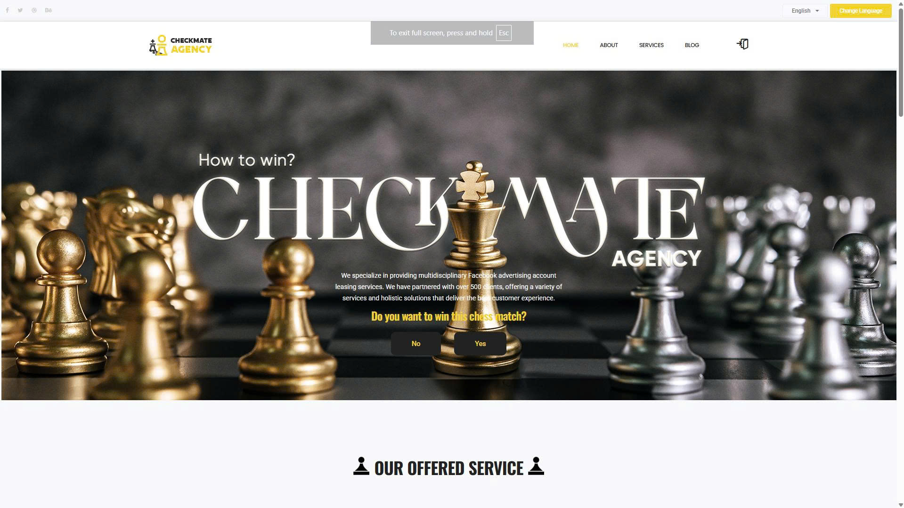
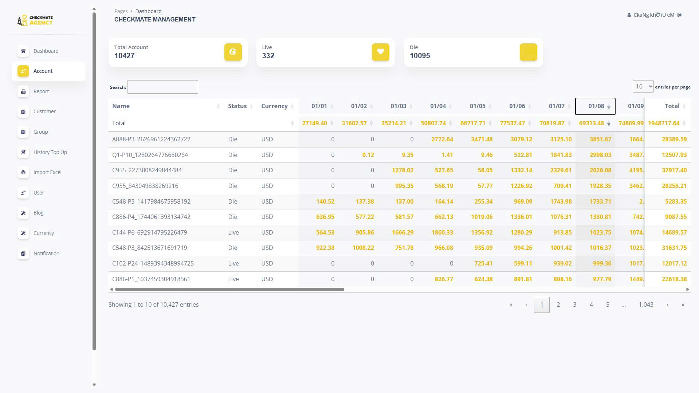
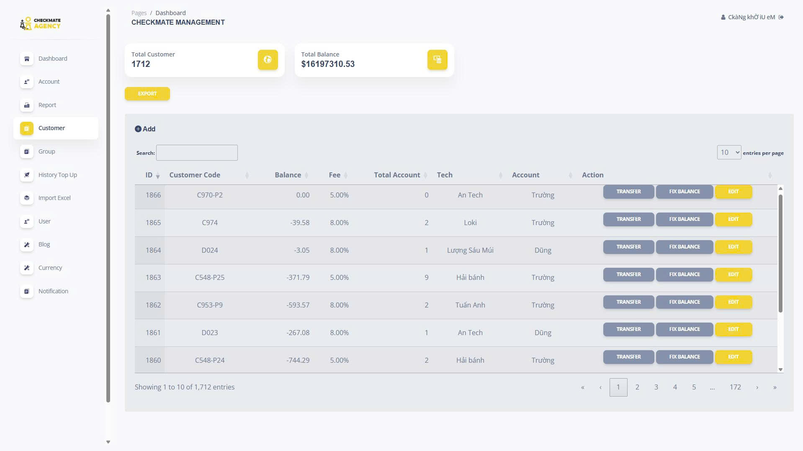

# Laravel Web Application

This project is a web-based management system designed to handle advertising operations for an agency specializing in Facebook Ads services.  
It provides features for managing expenses, balances, ad accounts, teams, clients, and administrators, allowing business owners to monitor performance in a clear and intuitive way.

The system is built for advertising agencies and businesses that want to move away from traditional management methods such as Google Docs, Excel spreadsheets, and paper-based workflows.

Main technologies used: PHP, Laravel, JavaScript, and MySQL.

## 📸 Screenshots

There are some screenshots of an actual agency using my web application.
[Checkmate-ads.com](https://checkmate-ads.com/)

### Dashboard Overview


### Client Homepage


### Ad Account Tracking


### Ad Customer Tracking


## 📋 Requirements

Make sure your system has:

- PHP >= 8.1  
- Composer  
- Node.js & npm  
- MySQL or MariaDB  

## Database Setup (Using SQL File) 

CREATE DATABASE your_database;
mysql -u your_username -p your_database < checkmate-ads-29012026.sql

## Setup

```bash
git clone https://github.com/username/repo.git
cd repo
composer install
cp .env.example .env
php artisan key:generate
php artisan serve
